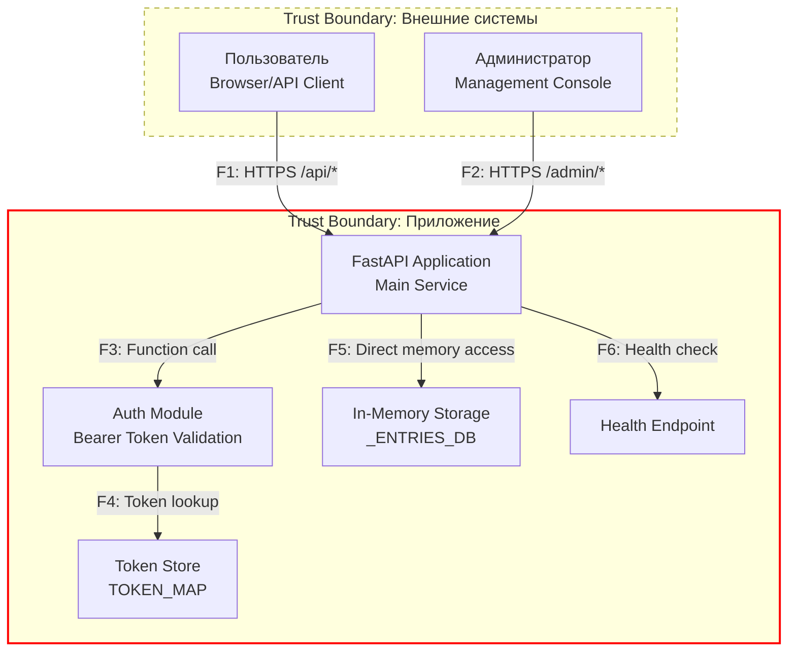

# Диаграмма потока данных (DFD)

## Контекст
Сервис представляет собой персональный трекер для управления списком материалов к прочтению/просмотру. Пользователи могут добавлять книги, статьи и видео, отслеживать их статус (запланировано, в процессе, завершено) и организовывать свою учебную или профессиональную библиотеку.

## Диаграмма

## Список потоков

| ID | Откуда → Куда | Канал/Протокол | Данные/PII | Комментарий |
|----|---------------|-----------------|------------|-------------|
| **F1** | User → FastAPI Application | HTTPS | Bearer token, JSON данные записей | Основной клиентский API трафик |
| **F2** | Admin → FastAPI Application | HTTPS | Админские credentials, управляющие команды | Привилегированный доступ для мониторинга |
| **F3** | FastAPI Application → Auth Module | Function call | Токен аутентификации | Внутренняя проверка подлинности |
| **F4** | Auth Module → Token Store | Dictionary lookup | Сопоставление токенов с пользователями | Статичная карта токенов в памяти |
| **F5** | FastAPI Application → In-Memory Storage | Direct memory access | Данные записей пользователей, PII | Хранение в _ENTRIES_DB словаре |
| **F6** | FastAPI Application → Health Endpoint | Internal routing | Статус сервиса | Мониторинг работоспособности |

## Компоненты системы

### Внешние сущности:
- **Пользователь** - основной клиент сервиса, работает с записями через REST API
- **Администратор** - осуществляет мониторинг и управление сервисом

### Процессы:
- **FastAPI Application** - основной сервис, обрабатывает все HTTP запросы
- **Auth Module** - модуль аутентификации, проверяет Bearer токены

### Хранилища:
- **Token Store** (TOKEN_MAP) - статичное хранилище токенов аутентификации
- **In-Memory Storage** (_ENTRIES_DB) - основное хранилище данных пользователей в оперативной памяти

### Границы доверия:
- **External** - ненадежная внешняя сеть (интернет)
- **App** - доверенная внутренняя среда приложения

## Особенности архитектуры
- Отсутствует внешний API Gateway - FastAPI приложение обрабатывает трафик напрямую
- Нет отдельной базы данных - используется in-memory хранилище
- Аутентификация реализована через статичные Bearer токены
- Все данные изолированы по пользователям на уровне приложения